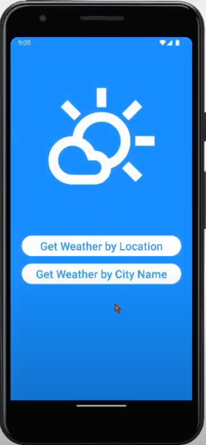
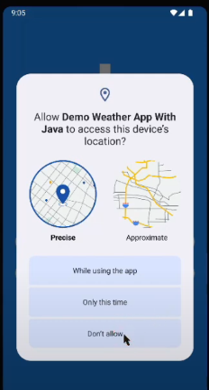
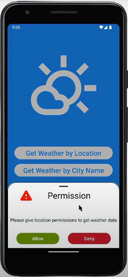
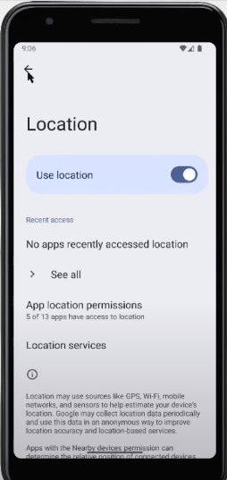
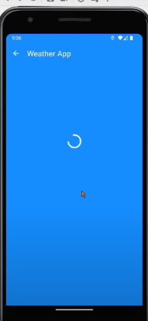
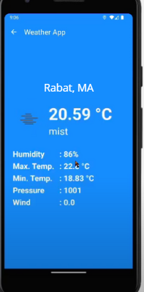
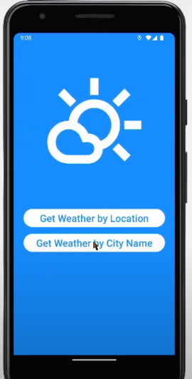
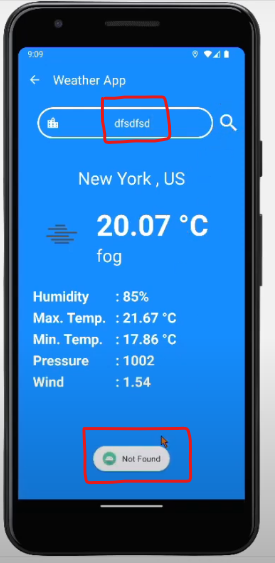

<h1>🌦️ Weather App</h1>

Une application mobile pour la platforme <b>Android</b> qui permet de consulter la météo en fonction 
de la géolocalisation (précise ou approximative) de l'utilisateur ou en fonction d'une ville.

 

<h2>🤖 Téchnologies utilsées</h2>
<ul>
<li><b>Platforme :</b> Android</li>
<li><b>Android API Min Sdk :</b> 24</li>
<li><b>Android API Max Sdk (target sdk) :</b> 36</li>
<li><b>Langage de programmation :</b> Java (jdk 11)</li>
<li><b>Construction de l'Interface utilisateur via :</b> XML</li>
<li><b>API de météo en temps réel :</b> OpenWeatherAPI</li>
</ul>

 

<h2>🔌 Dépendences utiles</h2>
<ul>
<li><b>swiperefreshlayout :</b> pour gérer facilement le rafraichissement de la page</li>
<li><b>retrofit :</b> sert à communiquer avec des API web (REST) de manière simple, rapide et propre</li>
<li><b>converter-gson :</b> permet de convertir automatiquement les réponses JSON en objets Java</li>
<li><b>picasso :</b> permet de charger une image depuis une URL dans une ImageView en une seule ligne de code</li>
</ul>

 

<h2>🎯 Démostration</h2>

<h4>✅ Lancement de l'application</h4>

Affichage de la vue principale activity_main, 
qui permet à l'utilisateur de consulter les données météorologiques 
d'une ville, ou en fonction de sa localisation 

 
<h4>
✅ Tentative de consultation des données météorologiques en fonction de la localisation de l'utilisateur
</h4>

L'utilisateur doit permettre à l'application d'accéder à sa localisation

 
<h4>
✅ L'utilisateur clique sur "Don't Allow" (ne n'autorise pas l'accès à sa localisation)
</h4>

L'application affiche un bottom_sheet_dialog layout qui explique à l'utilisateur que l'accès à sa localisation
 est necessaire pour qu'il consulte la météo

 
<h4>
✅ L'utilisateur autorise l'accès à sa localisation
</h4>

L'application affiche un messag box qui permet à l'utilisateur d'accéder aux paramètres pour activer la 
localisation 

 
<h4>
✅ L'utilisateur autorise l'accès à sa localisation
</h4>

L'utilisateur accède aux paramètres de la "Localisation" pour autoriser l'accès

 
<h4>
✅ L'utilisateur peut maintenant consulter la météo en fonction de sa localisation
</h4>

Récupération des données météorologique depuis l'API OpenWeatherAPI

 

Affichage des données météorologique dans la vue activity_weather.xml

 
<h4>
✅ Données météorologiques d'une ville
</h4>

L'utilisateur clique sur le bouton "Get Weather by City Name" pour consulter les données météorologique 
d'une ville

 
<h4>
✅ L'utilisateur saisit une ville et clique sur l'icon "loupe"
</h4>

Récupération des données météorologique de la ville "NewYork" depuis l'API OpenWeatherAPI

 
<h4>
✅ Message d'erreur
</h4>

L'utilisateur clique sur rechercher (l'icon loupe) sans saisir le nom d'une ville 

 
<h4>
✅ Message d'erreur
</h4>

L'API OpenWeather ne supporte pas le nom de cette ville ou nom de ville incorrecte

 

 
<ul>
<li>💻 <b>Réalisé par :</b> Iliasse Abdessamad</li>
<li>📚 <b>Sujet :</b> Developpement Mobile Natif pour la platforme Android</li>
<li>📅 <b>Année : </b> 2024 - 2025</li>
</ul>
